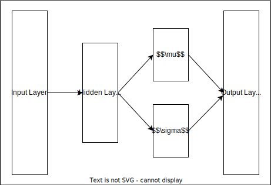

# Antibody Design
Originally this repository was about designing antibodies based on known epitopes. I wasn't able to find a database with antibody-epitope combinations specifically, but I was able to find the Immune Epitope Database and Analysis Resource ([IEDB](https://iedb.org)). They have data on T-cell receptors (TCRs), B-cell receptors (BCRs), and MHC ligands. Designing an antibody is a really complicated problem so I'm starting with a much simpler problem. How can we produce a sequence of amino acids that is similar to the known variable regions in known TCRs, BCRs, and MHC Ligands? The variable region is typically one of the most consequential as far as epitope binding so it's a natural place to start. There are also statistical measures for sequence similarity so we have a way to compare different models against known sequences (i.e. the problem is supervised and has a clean loss function).

# Motivation
Biologics are becoming increasingly relevant for developing therapeutics. Look no further than the recent mRNA COVID-19 vaccines as a testament to this development. A big step forward in developing precise therapeutics, however, is developing antibodies. Antibodies are proteins which help our immune system develop pattern recognition for pathogens. Alternatively, there could be antibodies which trick our immune system into thinking our healthy cells are pathogens. 

In both cases, understanding how to design antibodies based on the properties of previously successful antibodies as well as the current antigen of interest (i.e. the thing that antibody sticks to) is paramount. For example, we could develop patient-specific antibodies to attach to cancer cells which would allow the patient's immune system to selectively attack cancerous cells in a way that isn't possible with mainstream therapeutics like chemotherapy. 

The subproblem that this repository focuses on can also be useful in research and synthetic biology. There are companies which make nanobodies, which are essentially just the variable regions of an antibody. They are typically very small (~15 kilo Daltons) and offer protocol advantages due to their small size. The work done here, could help progress the creation of novel nanobodies for research and development.

# Approaches
For each of these approaches, I will outline the math in more detail in the latex folder.

## First Order Markov Model (`models/mm`) [Implemented]
This is the simplest models because it simply ignores the long-range dependencies. It assumes that only the previous amino acid is necessary to predict the following amino acid. This is probably not true but this model is still useful as a sanity check that is not simply the test data. Most other models, should outperform this one.

## Hidden Markov Model (`models/hmm`) [Not Implemented]
There are specific regions within the variable domain called complementary determining regions (CDRs) which are the most variable parts of the variable regions. We know where these sequences are so the hidden Markov model incorporates these as priors.

## Deep AutoEncoders (`models/dae`) [Not Implemented]
Given a sequence, can we simply train a deep neural network to reconstruct that sequence? This is the naive but machine learning way to perform sequence reconstruction.

## Variational AutoEncoders (`models/vae`) [Implemented]
Although it is an autoencoder at its core, this implementation uses the reparametrization trick outlined in [this paper from 2014](https://arxiv.org/abs/1312.6114). They showed that it is sufficient to simply learn a mu and sigma associated with a latent distribution of any distribution and recapitualte an input. This has worked empirically well in practice in other fields so it's worth trying out here.

  

## Vaswani Transformer (`models/vtransformer`) [Not Implemented]
I mean, how could you not try a transformer in this day and age?

---
# Validation
Some validation sets are still being worked on but basically, calculating n-grams and calculating KL Divergence on random subsamples are the primary benchmarks being used. Implementation details can be found in `models/benchmark.py`.